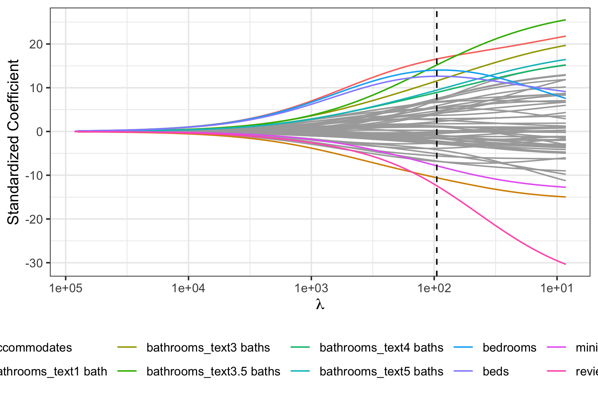

```{r setup, include=FALSE, message = FALSE, echo = FALSE}
options(scipen = 0, digits = 3)  # controls number of significant digits printed
library(tidyverse)
library(kableExtra)
library(randomForest)
library(corrplot)
library(float)
```


```{r, echo = FALSE}
data = read.csv("../data/clean/cleaned_listings.csv")
```

\bigskip

The code to reproduce this report is available [on Github](
https://github.com/tejaswib88/airbnb-pricing-project
).

\newpage

# Executive Summary

**Problem.** While the general impact of Airbnb and its short-term rentals on residential communities is substantial,  the impact at the neighbourhood or city level can be seen to be much more varying. People belonging to and visiting a particular city have a unique combination of factors that affects their affinity for short term housing, which in turn determines the price of an Airbnb listing. And in certain cities such as Asheville (North Carolina), the state of short-term rentals is so crucial to tourism that studying their pricing can be very important. For our final project, we are looking at the Airbnb listing data of Asheville and studying the relationship between amenities, duration of stay, number of customers, several other factors, and the price of an Airbnb listing. Considering these factors, we hoped to extract a way of explaining and predicting the price of an Airbnb listing so that stakeholders could have a clear understanding of how pricing of Airbnbs in this particular community could be strategized.

**Data.** We obtained data from the website of “Inside Airbnb”,  a mission driven activist project which aims to quantify the impact of short-term rentals on housing and residential communities. The dataset included the price of Airbnb listings and a number of features related to them such as room type, duration of stay, number of views of the listing, and several more. Our explanatory variables could be divided into three categories: host details (e.g. host response time, host acceptance rate) , room characteristics (e.g. room type, bathroom type), and reviews (review scores rating, number of reviews). As mentioned above, our primary response variable was the daily price in local currency (labelled as “price”).

**Analysis** The main aim of our analysis is to better understand what listing attributes contribute to prices and to develop a model that can reasonably predict the prices of listings, and can at some point be used by hosts to be more efficient with their pricing. After the cleaning process, we had 1,882 listings which we split into training and testing sets. Our exploratory data analysis studied the variation of our response variable and its relationship with features from the three main feature categories, namely host, room, and review related features. The main aim of our exploratory analysis was to uncover some preliminary trends on important attributes that can influence prices, and to get a better understanding of the distribution of our response variable, the price, and the correlation between different features. We further predicively modelled price using a range of statistical machine learning methodologies including Ordinary Least Squares, Ridge Regression, Lasso Regression, and Random Forest. For each model, we extracted important contributing features to better understand features that have predictive potential when it comes to prices. Lastly, we utilised these to come up with recommendations and takeaways for current and new airbnb hosts on pricing their properties and to potentially improve the value of their listings on the platform.

**Conclusions** Overall, from our analysis, we found that we can reasonably predict prices based on the given explanatory parameters. We further determined variables that were stronger predictors including number of accomodates, bathroom text, review scores, etc. Additionally, our analysis allowed us to extract certain strategies that can be followed by stakeholders to optimise the value of their lisitng such as motivating guests to review, in particular for parameters such as cleanliness and location, getting verified through multiple channels, and working towards becoming a superhost. Overall, we believe we were able to move closer to he goal of building a replicable model that hosts can make use of to understand their price/value of their listing, while uncovering interesting insights on how hosts can potentially boost the appeal of their listings.

# Introduction

**Background.** Asheville has been Airbnb’s most hospitable city in the US for the past few years. Local Airbnb hosts earned $19.8 million in 2017, which is more than the collective revenue of the next four biggest cities in North Carolina.^[Airbnb Prevalence in Asheville:  https://www.citizen-times.com/story/news/local/2018/08/30/airbnb-asheville-3-percent-highest-used-rate-united-states-housing/1143441002/]  Additionally, the ‘Convention and Visitors Bureau of Asheville’ has concluded that tourism is vital for the economy of the city because of visitor spending at local businesses and taxes generated by tourism.^[Importance of Tourism in Asheville: https://www.ashevillecvb.com/tourism-builds-community/] Considering Airbnb’s crucial position in tourism, the ability to optimally determine the price of Airbnb’s listings can help utilize the platform’s success and generate the maximum revenue possible from short-term rentals. This in turn would significantly contribute to the city’s prosperity. Additionally, with an increasing number of people using Airbnb, and being hosts, a better way to price would increase transparency on the market and better equip new hosts to get their journey kickstarted. Additionally, a better understand of listing related factors driving prices can further allow hosts to increase the value of their listings and ultimately, earn better passive income through the platform.

**Analysis goals.** The main aim of our analysis is to better understand what listing attributes contribute to prices, and use this to develop reommendations on factors that airbnb hosts can consider when pricing their properties and those that they can potentially use to increase the value and appeal of their properties on the platform. To do so, we performed a series of exploratory analysis to uncover the relationships between key listing and host attributes and prices, and further performed predictive modelling to better understand features that significantly contribute to price. These features were split across three main categories: host, room/acommodation, and reviews, and detailed description on each feature used can be found within the Appendix. The goal of our analysis was two fold -- to not only explain factors behind different prices, but to also build a model that can in practice be used by hosts to price their offerings. Thus, we choose root mean squared error as the metric of choice to evaluate the model, gives its high interpretability in the context of data.

**Significance.** The significance of this analysis can be traced back to Airbnb's explosive growth and the rise in the number of people using this as a source of passive income. A better understand of factors driving prices can allow Airbnb hosts to more successfully operate on the platform. Additionally, a better understanding of features driving higher prices can further allow hosts to increase the value of their property by optimizing things within their control. Airbnb is a lucrative channel for passive income, and as we come out of the COVID pandemic with a likely pent-up demand for travel, potential hosts looking to earn through this channel can take away insights on factors driving prices an more strategically operate their listings.

# Data

## Data sources

We obtained our dataset from the website of “Inside Airbnb”, a mission driven activist project which aims to quantify the impact of short-term rentals on housing and residential communities.^[Inside Airbnb Project: http://insideairbnb.com/about.html] The project collects data on Airbnb listings of about 80 cities around the World using a scraping algorithm. The project was founded by Murray Cox, an Australian-American community activist who started scraping information from the Airbnb website in 2014 and compared it to public data release from the company. Considering that Asheville is the most hospitable city in the US with reference to Airbnb, the website has extensive listing data for the  city.^[Airbnb Asheville Dataset: http://insideairbnb.com/get-the-data.html]

## Data cleaning

We started with removing some unnecessary columns that were in the raw dataset. We then created features for the length of the description of listing and the amount of days a host had been on airbnb. Each host can have a number of verifications.  To abstract away the complexity of handling each verification separately, we used the number of verifications as a proxy for the potential credibility of a listing to eventually investigate if this would have any impact on the price. We had to convert several columns into different formats for them to be useful for analysis, such as the price column into a double by removing characters from it, percentage variables into doubles, and all the character data types into factors for modelling. Finally, we dropped all the listings which had any NA values. Having started with 2,563 listings, our cleaned dataset had 1,882 listings.

## Data description
The cleaned dataset had 1,882 entries which each represent a unique listing on Airbnb within Asheville. Each entry shows a specific listing. For each listing, there are a total of 34 features including room types, host status, reviews, among others. A detailed description of these variables can be found within the Appendix

### Response Variable
The response variable is the Price of the Airbnb listing, which is a continuous variable. In studying the distribution of the response variable “Price”, the price is right skewed which reflects the fact that there are several listings which are priced over $250 even though the median is $150. There is a long tail to the right reflecting outlier listings with extremely high pricing, which makes it interesting to predict potential factors that enable high pricing. This distribution can be seen in Figure \@ref(fig:price-plot)

```{r price-plot, fig.cap = "Distribution of prices", fig.align = "center", echo = FALSE, out.height = "80%", out.width = "80%"}

```

## Data allocation
We used an 80-20 split for this project such that 80% of the 1,882 clean entries were used for training and 20% of the entries were used for testing. Since we had categorical variables, the split was performed when training each model, however a fixed seed was used to make sure that the split is constant, and a fair judgement on the performance of models explored later can be studied.

## Data exploration

### Response

Considering the Top 10 listings by Price seen in Table \@ref(tab:top-tab), it can be seen that the hosts for these listings operate at top quality standards. All hosts of the 10 most expensive Airbnb listings respond to every message within an hour and 9 out of them are superhosts.

```{r top-tab, echo = FALSE}
top_10_prices = read.csv("../results/top-10-prices.csv")
top_10_prices %>% kable(format = "latex", row.names = NA, 
        booktabs = TRUE, digits = 2, 
        col.names = c("Price", "Response Time", "Response Rate", "Is Host a Superhost?"),
        caption = "Top 10 Listings by Price") %>%
  kable_styling(position = "center", latex_options = "hold_position")
```
\newpage
### Features

#### Correlation Map of All Variables 

To begin with, we analysed the correlation between our numeric explanatory features to better understand their relationships with each other. This can be seen in Figure \@ref(fig:corr-plot)

```{r corr-plot, fig.cap = "Correlation between explanatory features", fig.align = "center", fig.height = 10, fig.width = 10, echo = FALSE}
numeric = data %>% select(-price)
numeric = numeric[, !sapply(numeric, is.character)]
res = cor(numeric)
corrplot(res)
```

As we see, most features are not strongly correlated with each other, however, some clusters of features do showcase a positive relationship. For instance, we observe a positive correlation between number of people accomodated, number of bedrooms, and number of beds, which are features that are intuitively closely linked to one another. In addition, we see a close relationship between availabilities at different dates. Lastly, we also see positive correlations between different review scores, which we would once again expect. Here, we made a decision to leave all features within the explanatory set, however, another possible method would be to drop highly correlated features, which we can further experiment with in future iterations of this analysis.

\newpage

#### Analysing Relationship between price & key variables

In addition to the above, we analysed the relationship between price and some key variables to uncover potential attributes of houses. The results of this analysis are as follows

**Price by Room Type** 

We created a boxplot graphic to study the relationship between the type of the room within the listing (Entire home, Hotel Room, Private Room, and Shared Room). As we expected, hotel rooms were the most expensive kind of listing in distribution. While entire homes or apartments were second in terms of pricing, they had a large number of outliers which had rent upwards of $500. On the other hand, private or shared rooms tend to have lower prices. This can be seen in Figure \@ref(fig:room-plot).

```{r room-plot, fig.cap = "Prices by Room Type", fig.align = "center", out.height = "40%", out.weight = "40%", echo = FALSE}

```

\newpage
**Price and Number of Reviews**

A key feature which belongs to the category of reviews was the number of total reviews provided on a listing. Our initial understanding was that a listing which has high reviews would transfer its popularity in its pricing. However, as the scatterplot shows, generally, at high number of reviews, the listings tended to have lower price. This is an interesting revelation and a potential reason for this could be that the clientele for lower priced listings is more likely to be supportive of their hosts, among others. This can be seen in Figure \@ref(fig:reviews-plot)

```{r reviews-plot, fig.cap = "Number of reviews and prices", fig.align = "center", echo = FALSE, out.height="80%", out.width="80%"}

```

\newpage
**Price and Superhost Status**

We also wanted to test whether most listings which are created by superhosts are priced higher than otherwise. However, we found that the median price of a listing for superhosts is the same as those listings whose hosts are not superhosts. An additional aspect to note though is that superhosts had much more outliers in terms of listings whose prices are considerably higher than the median. This can be seen in Figure \@ref(fig:superhost-plot)

```{r superhost-plot, fig.cap = "Superhost status and prices", fig.align = "center", echo = FALSE, out.height = "80%", out.width = "80%"}

```

\newpage
**Price & Verification**

Additionally, we analysed how a host's identity being verified can influence prices. Based on the plot below, we see that while listings with verified host identities have a higher median price, the difference is likely minimal and both have outliers tending to higher prices. This was an interesting finding especially considering our hypothesis that verification would result in a boost in prices due to higher credibility in the hands of a verified host. This can be seen in Figure \@ref(fig:verification-plot).

```{r verification-plot, fig.cap = "Host verification and prices", fig.align = "center", echo = FALSE, out.height = "80%", out.width = "80%"}

```

\newpage
**Price & Time taken by host to respond**

We further analysed how a host's response time affects price. As was our hypothesis, we see that quicker responses yield a higher median price, and furthermore, listings with a host that responds quicker have more outliers tending to higher prices, which indicates that being responsive can be a way to boost value of a property. What is interesting is that the jump in median prices between hosts that respond within a few days and more andd those that respond within a day is much higher compared to subsequent jumps, indicating that taking more than a day in responding can be especially disadvantageous. This can be seen in Figure \@ref(fig:response-plot).

```{r response-plot, fig.cap = "Host response time and prices", fig.align = "center", echo = FALSE, out.height = "80%", out.width = "80%"}

```

# Modeling

## Regression-based methods

### Ordinary least squares

To begin our analysis, we ran an ordinary least squares regression on price against the 34 potentially explanatory variables. To understand drivers behind prices, we further studied the variables with a p-value lesser than a significance level of 0.05. Among these, we can specifically take a look at actionable features i.e. those that can be changed or optimized by the host. Actionable features that were deemed significant by the OLS model include being a superhost, number of listings, cleanliness review scores, and number of verifications.

The multiple least squares further indicated that the variables captured 67.3% of the variation which, while not perfect, gives us a fairly solid proof of concept. Additionally, since our objective with this investigation is to yield factors contributing to a high price, we can sacrifice some levels of metric optimization for the purpose of explaining the impact of different listing attributes on price. 

\newpage

### Penalized regression

While ordinary least squares worked fairly well, we further decided to experiment with penalized regression models since ordinary least squares models might suffer from overfitting and high variance, and regularization can allow us to get to a more robust model.

To begin with, we ran a cross validated ridge regression model on the price against the 34 explanatory variables. Figure \@ref(fig:ridge-features) showcases the top 10 features selected first by the ridge model. 

```{r ridge-features, fig.cap = "Top features in ridge regression", fig.align = "center", echo = FALSE, out.height = "80%", out.width = "80%"}

```

\newpage

Furthermore, we also implemented a cross validated lasso regression model. The model ended up selecting all features, potentially indicating that ridge regression might have been a better choice. Nevertheless, the first 10 features selected by the model can be seen in Figure \@ref(fig:lasso-features-plot) 

```{r lasso-features-plot, fig.cap = "Top features in lasso regression", fig.align = "center", echo = FALSE, out.height = "80%", out.width = "80%"}

```

Furthermore, from the lasso model, we extracted the coefficients to analyse the top 10 contributing parameters within the cross validated model that contributed to price. This was done by selecting the top 10 features based on the highest absolute coefficient values. These are demonstrated in Table \@ref(tab:lasso-coefficients). 


```{r lasso-coefficients, message = FALSE, echo = FALSE}
read.csv("../results/top10_features.csv") %>%
  kable(format = "latex", row.names = NA, 
        booktabs = TRUE, digits = 2, 
        col.names = c("Feature", "Coefficient"),
        caption = "Standardized coefficients for features in the lasso 
        model based on the one-standard-error rule.") %>%
  kable_styling(position = "center", latex_options = "hold_position")
```

Based on Table \@ref(tab:lasso-coefficients), we see the top 20 most contributing features within the lasso model. What is interesting is that the review score for value has a negative coefficient, which seems to be contradictory to what one might imagine considering that higher review scores should increase value. Among the other features, perhaps the most actionable one is review scores for cleanliness, which has a high positive coefficient indicating that cleanliness is important sometimes even more so than the location review. Another actionable feature here is the number of verifications.

\newpage

## Tree-based methods

### Random forest

Beyond regression models, we further experimented with tree based methodologies. In particular, we created a random forest model to predict price based on the aforementioned 34 features. When training the model, we further tuned the number of parameters considered at each split. We tried values ranging from 1 to 30, and the out-of-bag errors for each of these is demonstrated in Figure \@ref(fig:rf-tuning-plot)

```{r rf-tuning-plot, fig.cap = "OOB Errors and number of features at each split", fig.align = "center", echo = FALSE, out.height = "80%", out.width = "80%"}

```

We see above that the out of bag error is minimized when at 17 features for each split. We used this tuned value of the parameter to construct our final model. Based on this, we analysed the variable importance using both OOB and purity variable importance to better understand features that are strong predictors towards price. The results of this are demonstrated in Figure \@ref(fig:var-imp-plot)

\newpage

```{r var-imp-plot, fig.cap = "Random Forest Variable Importance", fig.align = "center", echo = FALSE, fig.height = 10, fig.width = 8}
load("../results/rf_finalfit.Rda")
varImpPlot(rf_finalfit)
```
\newpage
From the variable importances, we see that based on the left metric, actionable features include number of listings by host, review scores for location and value, number of verifications by the host, along with more obvious ones such as number of accomodates, etc. Based on the metric on the right hand side, actionable features deemed important were number of listings by host, number of days hosting, and review scores for value and location.

Looking at each of the above models, we definitely see some commonalities, and overall a few actionable features that were deemed important, most notably number of listings by host, review scores for parameters like cleanliness and location, number of verifications, and being a superhost.

\newpage

# Conclusions

## Method comparison

Overall, we experimented with 4 distinct modelling methodologies, namely OLS, ridge regression, lasso regression, and random forests. To analyse each of them, we considered the root mean squared errors by analysing their predictions on the test dataset. In addition to the above variables, we further included an intercept only model, which predicts the average price from the training dataset for each listing, as a benchmark to better understand the predictive potential of our models. The results of this investigation are summarized in Table \@ref(tab:model-evaluation)

```{r model-evaluation, message = FALSE, echo = FALSE}
read.csv("../results/model-evaluation.csv") %>%
  kable(format = "latex", row.names = NA,
        booktabs = TRUE, digits = 2,
        caption = "Root-mean-squared prediction errors for lasso and ridge regressions.") %>%
  kable_styling(position = "center", latex_options = "hold_position")
```

As seen above, each of the models experimented with perform better than the intercept only model which has an RMSE of ~137, indicating that there is some predictive potential for each. Clearly, the random forest model outperforms the others with an RMSE of ~ 77 as compared to the linear, ridge, and lasso models which have an RMSE of ~93. While considering that our mean price is ~190, we can see that our RMSE values are moderately high, for the purposes of our investigation our models nevertheless give us interesting insights on predictive factors towards optimal listing prices. 

## Takeaways

Overall, pricing depends on a number of factors as seen within our models. Some of them are obvious including the number of accomodates, bedrooms, etc. however, we were able to determine a few actionable parameters that hosts should consider when pricing and those that they can optimise for.

For instance, review scores for cleanliness seemed to be a parameter of importance. For this, hosts can not only focus on keeping the properties clean, but motivate guests to review them on this parameter and on other parameters such as location.

Additionally, number of verifications was also a parameter of interest. For this, hosts should try and get verified on a higher number of sources such as email, etc. as this would likely grant them more credibility, potentially increasing the appeal of the listing to potential guests.

Being a superhost was further deemed by the OLS model as a significant factor, and hosts should strive to achieve this status by improving level of hospitality for their guests while working with Airbnb.

Ultimately, prices are influenced by a number of factors and hosts can not only use the above models created to determine what would be a suitable price for their property, but can also apply some of these principles to boost the value of their properties.

## Limitations

### Dataset limitations

The dataset in consideration did present some challenges that could potentially be addressed going forward. Firstly, the data was reliant on scraping performed by a third party as opposed to Airbnb itself, increasing the likelihood of potential deviations from the true picture. In addition, we found that the listing prices were those quoted by the hosts as opposed to ones actually paid. While the fact that most listings had previously been reviewed and consumed is indicative that these prices have worked, a dataset on deals completed could be better to analyse optimal ways of pricing an Airbnb property. Additionally, the dataset used was only for a specific geographical region, namely Asheville, and a wider group of regions could further give a better picture of the reality on a macro level, which could increase the scope and applicability of this analysis. Additionally, there were missing values in some instances, which had to be dropped, limiting our data size. Regardless of these limitations, we were able to determine interesting relationships between listing attributes and prices, and going forward, we hope to address some of these challenges to increase the robustness of our analysis.

### Analysis limitations

Within our analysis, we used proxies for certain variables such as amenities and verifications, whereas considering the presence of each amenity of verification as a categorical variable could potentially yield better insights. In addition, a number of textual features were dropped within the scope of this analysis such as neighbourhood overview and host information. Factoring this within our predictive models could have improved the relevance of our analysis particularly considering that authentic and catchy descriptions generally lend credibility to a listing and may allow hosts to charge higher prices if they are able to better sell their listings using such tactics. On a more subtle implementation related note, using a different seed when splitting the data might further lead to different results, which could be another area to expand to going forward. Additionally, we saw that our RMSE values were moderately high, indicating that further tuning might be required.

## Follow-ups
We truly believe that a transparent idea for pricing Airbnb listings could be extremely beneficial given the number of people using these as a source of passive income and the rising prevelance of the model. To this end, there are a number of ways in which this analysis can be taken forward particularly to address the aforementioned dataset and analysis limitations. Firstly, we can try collected price data on completed deals to get an idea of prices that work instead of using quoted prices as a proxy. Further, we can perform the analysis on a wider dataset considering multiple geographical regions. Additionally, we can analyse textual features using tfidf, word2vec, and other feature extraction methods to incorporate their effect towards price. Moreover, it would further be beneficial to conduct the analysis with the missing data collected, as that could give more robust interpretations on even the current datasets.


\appendix

# Appendix: Descriptions of features {#appendix}

Below are the 34 features we used for analysis. Words written in parentheses represent variable names. Unless noted otherwise, all variables are continuous. 

**Host features**

- *Host Response*
  - Host Response Rate (`host_response_rate`): Measure of how soon the host responds to messages of guests.
- *Host Miscellaneous*
  - Host Acceptance Rate (`host_acceptance_rate`): That rate at which a host accepts booking requests.
  - Host Superhost Status (`host_is_superhost`): Boolean variable showing whether a host is a superhost or not.
  - Host Listings Count (`host_total_listings_count`): The number of listings the host has (per Airbnb calculations)
  - Host Profile Pic Status (`host_has_profile_pic`): Boolean showing whether host has a profile picture or not.
  - Host Identity Verification Status (`host_identity_verified`): Boolean showing whether host's identity has been verified or not.
  - Number of verifications (`num_verifications`): Number of different possible methods of verification for listing, such as email, telephone, etc

**Room/Accomodation Features::**

- *Amenities*
  - Accomodates (`accomodates`): Maximum capacity of the listing
  - Room Type (`room_type`): Type of room, being one of the four: entire place, private rooms, hotel rooms, and shared rooms. 
  - Listing Capacity (`accommodates`): The maximum capacity of the listing
  - Number of Bathrooms (`bathrooms_text`): The number of bathrooms in the listing. 
  - Number of Bedrooms (bedrooms): The number of bedrooms
  - Number of Beds (`beds`): The number of bed(s)
  - Minimum Number of Nights (`minimum_nights`): Minimum number of night stay for the listing (calendar rules may be different)
  - Minimum Number of Nights(`maximum_nights`): Maximum number of night stay for the listing (calendar rules may be different)
  - Days Hosted (`days_hosting`): Number of Days hosted.
  - Number of Amenities (`num_amenities`): The number of amenities available for listing.
- *Booking Features*  
  - Availability after 30 Days (`availability_30`): The availability of the listing 30 days in the future as determined by the calendar. 
  - Availability after 60 Days (`availability_60`): The availability of the listing 60 days in the future as determined by the calendar. 
  - Availability after 90 Days (`availability_90`): The availability of the listing 90 days in the future as determined by the calendar. 
  - Availability after 365 Days (`availability_365`): The availability of the listing 365 days in the future as determined by the calendar. 
  - About Length (`about_length`): Length of the about description of the host.
  - Instant Bookable (`instant_bookable`): Boolean variable showing whether the guest can automatically book the listing without the host requiring to accept their booking request. An indicator of a commercial listing.

  
**Review Features** 
number_of_reviews; number_of_reviews_ltm; number_of_reviews_l30d; review_scores_rating; review_scores_accuracy; review_scores_cleanliness; review_scores_checkin; review_scores_communication; review_scores_location; review_scores_value; instant_bookable; reviews_per_month

- *Frequency*
  - Number of Reviews (`number_of_reviews`): The number of reviews the listing has.
  - Number of Reviews in Last Year (`number_of_reviews_ltm`): The number of reviews the listing has (in the last 12 months).
  - Number of Reviews in last 30 Days (`number_of_reviews_l30d`): The number of reviews the listing has (in the last 30 days).
  - Number of Reviews per month (`reviews_per_month`): The number of reviews the listing has over the lifetime of the listing.
- *Review Qualitative Features* 
  - Average Review Rating (`review_scores_rating`): Average review rating given to a listing.
  - Review Scores Accuracy (`review_scores_accuracy`): Accuracy review scores
  - Review Scores Cleanliness (`review_scores_cleanliness`): Cleanliness review scores
  - Review Scores Checking (`review_scores_checkin`): Checking review scores
  - Review Scores Communication (`review_scores_communication`): Communication review scores
  - Review Scores Location (`review_scores_location`): Location review scores
  - Review Scores Value (`review_scores_value`): Value review scores